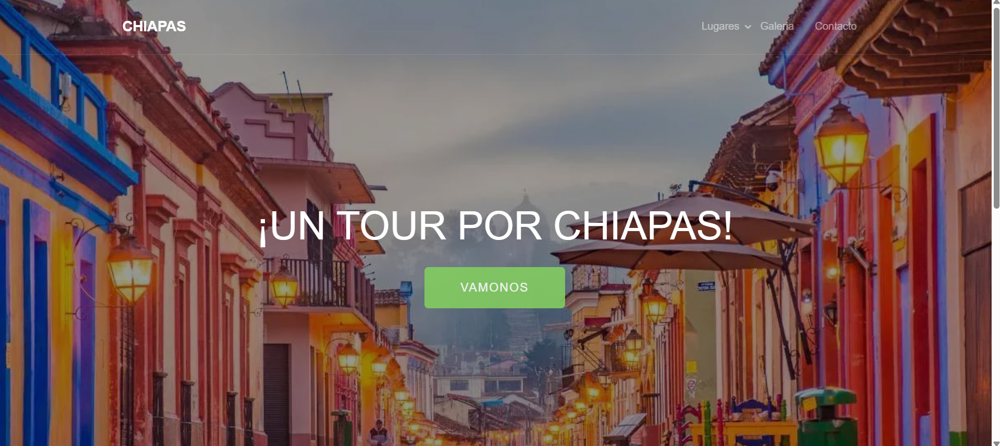
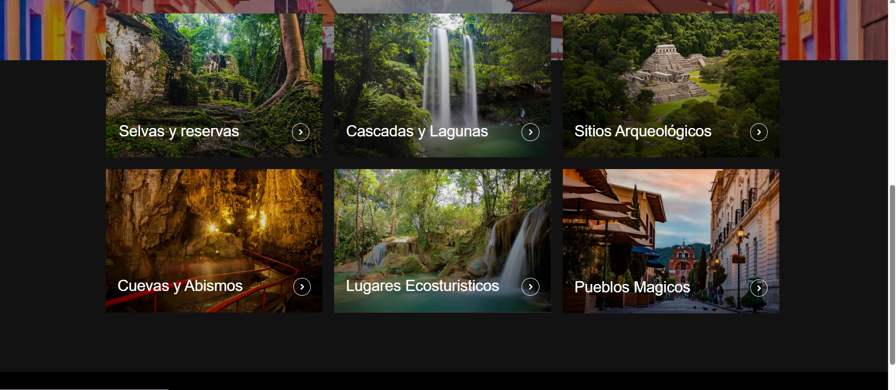
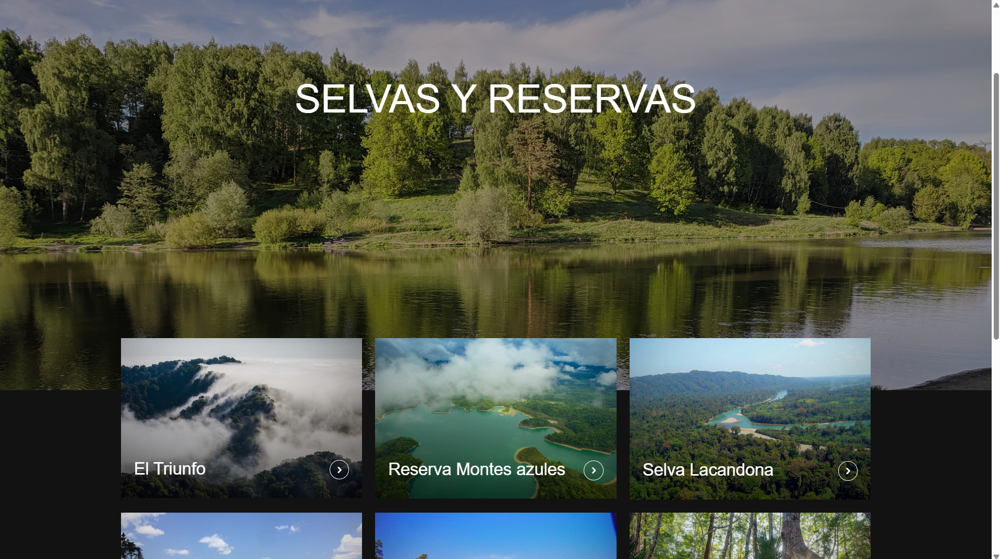
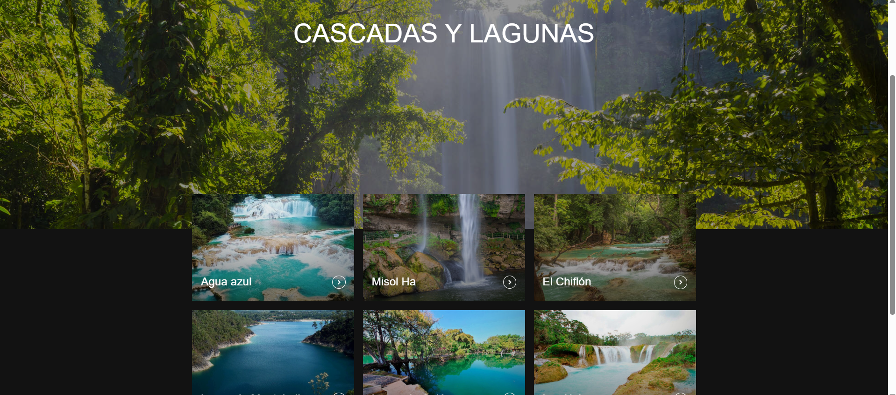
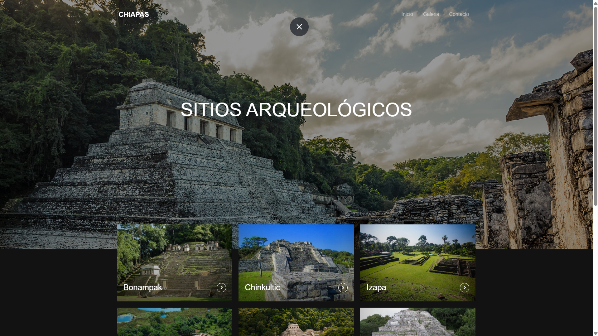
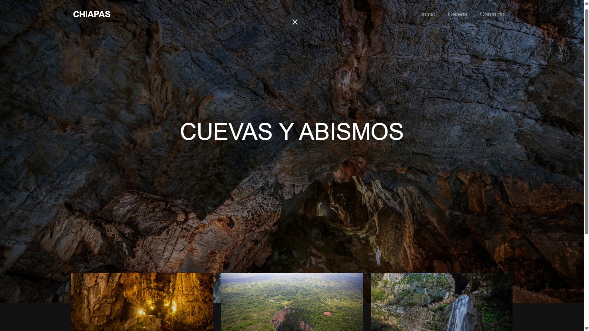
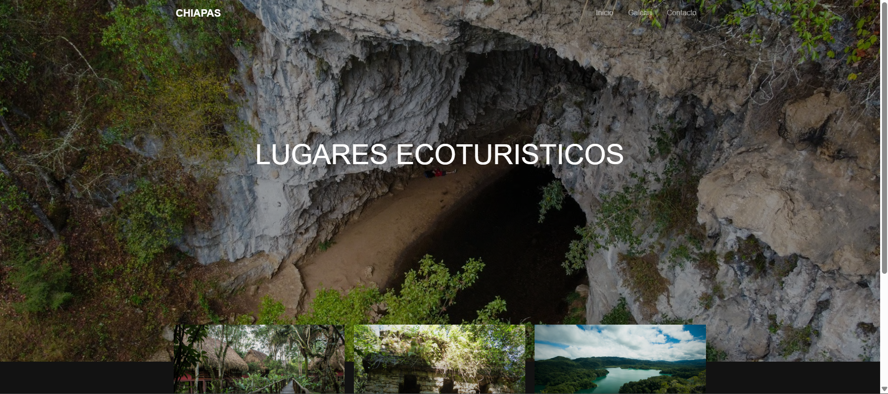
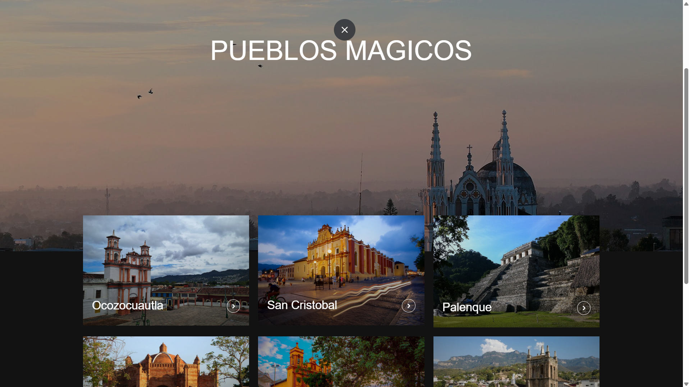
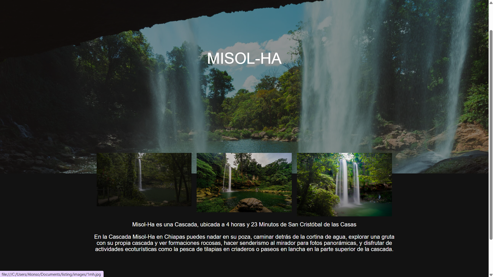

# Chiapas Tourism Website

Sitio web desarrollado para promover lugares turísticos y cultura de Chiapas.

## Características

* Diseño web informativo
* Interfaz visual enfocada en turismo
* Organización de contenido turístico
* Diseño responsivo básico

## Tecnologías utilizadas

* HTML
* CSS
* JavaScript

## Vista previa

## Objetivo

Practicar desarrollo web y diseño de interfaces enfocadas en promoción turística.

## Autor

Alonso Flores
